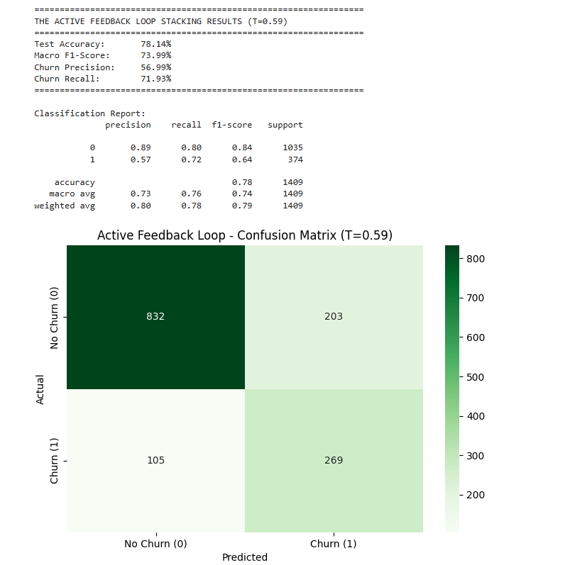

# Customer Churn Prediction

A machine learning project that predicts customer churn on the IBM Telco Customer Churn dataset using ensemble learning, explainable AI techniques, and optimized decision threshold selection.

## Project Overview

Customer churn is a major challenge for subscription-based businesses.  
The goal of this project is to identify customers who are likely to leave and help businesses apply proactive retention strategies.

**Dataset:** IBM Telco Customer Churn Dataset  
- 7,043 customers  
- 21 features  
- Demographic, account, and service-related information

---

## Methodology

### Exploratory Data Analysis (EDA)
- Distribution analysis
- Feature relationship analysis
- Churn pattern investigation

### Data Preprocessing
- Yeo-Johnson transformation for numerical features
- ColumnTransformer pipeline for numerical and categorical variables
- Feature engineering with K-Means clustering

### Machine Learning Models

Baseline models:
- Random Forest
- Gradient Boosting
- XGBoost
- LightGBM
- CatBoost

Final model:
- Stacking Ensemble
- Base learners: XGBoost, LightGBM, CatBoost
- Meta learner: Logistic Regression

### Optimization
- Optuna-based hyperparameter optimization
- Threshold tuning using out-of-fold predictions
- Decision threshold selected as 0.59

### Explainability
- SHAP analysis to understand feature contributions
- Error analysis on model predictions

---

# Final Model Performance

**Stacking Ensemble Results (Threshold = 0.59)**

| Metric | Score |
|---|---:|
| Accuracy | 78.14% |
| Macro F1-Score | 74.02% |
| Churn Precision | 56.96% |
| Churn Recall | 72.19% |

The model prioritizes churn recall because missing a customer who is likely to leave can create a higher business cost than a false alarm.

---

# Baseline Model Comparison

| Model | Accuracy | Recall | Macro F1 |
|---|---:|---:|---:|
| Random Forest | 77.21% | 69.25% | 72.76% |
| Gradient Boosting | 80.41% | 51.07% | 72.64% |
| XGBoost | 76.15% | 76.47% | 72.70% |
| LightGBM | 76.22% | 79.14% | 73.07% |
| CatBoost | 75.16% | 80.75% | 72.27% |

---

# Error Analysis

Model mistakes were analyzed to understand prediction behavior.

**False Negative (Missed Churn):**
- Customers predicted as staying but actually churned

**False Positive (False Alarm):**
- Customers predicted as churning but actually stayed

This analysis helps understand model behavior and improvement areas.

---

## Live Demo

Try the interactive application:

https://customer-churn-prediction-telco-8sbzcddyv5txzj4u5uyftx.streamlit.app/


# Project Screenshots


---

# Classification Report



---

# Tech Stack

Python · pandas · scikit-learn · XGBoost · LightGBM · CatBoost · Optuna · SHAP · Streamlit

---

# Repository Contents

| File | Description |
|---|---|
| `churn_prediction_model.ipynb` | Full notebook including EDA, preprocessing, modeling, tuning and evaluation |
| `demo_app.py` | Streamlit application for live churn prediction |
| `WA_Fn-UseC_-Telco-Customer-Churn.csv` | Dataset used in the project |

---

# Running the Demo

```bash
pip install streamlit pandas numpy scikit-learn xgboost lightgbm catboost
streamlit run demo_app.py
